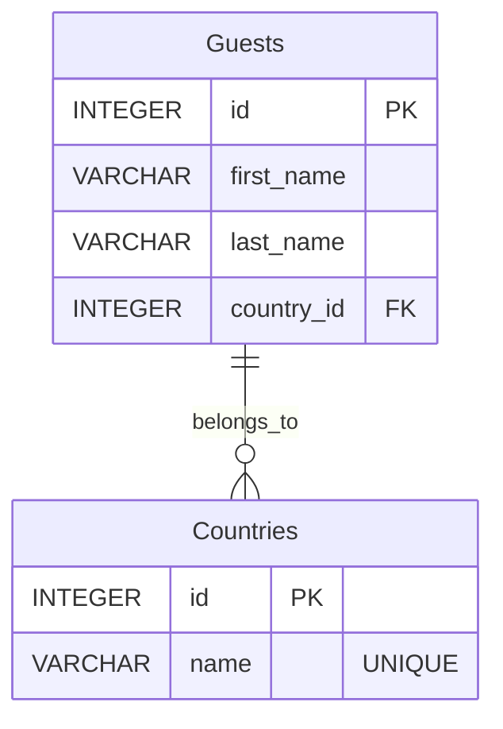

# Guest Service Microservice


## Overview

The Guest Service Microservice is a crucial component of the Hotel Kong Arthur management system, designed to handle all guest-related operations efficiently. It provides robust APIs for guest registration, profile management, and country-based guest tracking. The service automatically seeds initial guest data from a CSV file and maintains a relational database structure for optimal data organization.

Key functionalities:
- Seamless guest registration and profile updates
- Country-based guest categorization and tracking
- Automated data seeding from CSV files
- RESTful API endpoints for easy integration
- Docker containerization for consistent deployment

## Project Structure

```
GuestService/
│
├── csv/
│   └── international_names_with_rooms_1000.csv  # Initial guest data
│
├── db/
│   ├── db.py                                    # Database operations
│   └── guest_service.db                         # Database
│
├── .dockerignore                                # Docker ignore rules
├── .gitignore                                   # Git ignore rules
├── app.py                                       # Main Flask application
├── Dockerfile                                   # Docker configuration
├── README.md                                    # Project documentation
└── requirements.txt                             # Python dependencies
```

## Prerequisites

Before running the service, ensure you have:

- [Docker Desktop](https://www.docker.com/products/docker-desktop/)
- [Python 3.x](https://www.python.org/downloads/) (for local development)
- [Postman](https://www.postman.com/downloads/) (for testing)

## Installation

### Docker Setup (Recommended)

1. Build the Docker image:
```bash
docker build -t guest_service .
```

2. Run the container:
```bash
docker run -d -p 5001:5001 --name guest_service --network microservice-network guest_service
```

### Local Development Setup

1. Create and activate virtual environment:
```bash
python -m venv venv
source venv/bin/activate  # On Windows: venv\Scripts\activate
```

2. Install dependencies:
```bash
pip install -r requirements.txt
```

3. Run the application:
```bash
python app.py
```

## Database Schema



## API Documentation

| Method | Endpoint                | Description                | Request Body Example                                     | Response Example                                                       |
|--------|-------------------------|----------------------------|---------------------------------------------------------|----------------------------------------------------------------------|
| GET    | `/api/v1/guests`       | Get all guests             | N/A                                                     | `[{"id": 1, "first_name": "John", "last_name": "Doe", "country_id": 1}]` |
| GET    | `/api/v1/guests/<id>`  | Get guest by ID            | N/A                                                     | `{"id": 1, "first_name": "John", "last_name": "Doe", "country_id": 1}`   |
| POST   | `/api/v1/guests`       | Add new guest              | `{"first_name": "Jane", "last_name": "Smith", "country_id": 12}` | `{"message": "Guest added successfully"}`                            |
| GET    | `/api/v1/countries`     | Get all countries          | N/A                                                     | `[{"id": 1, "name": "China"}, {"id": 12, "name": "United Kingdom"}, {"id": 14, "name": "France"}, {"id": 6, "name": "Canada"}]`      |


## Testing with Postman

1. Open Postman and create a new collection named "Guest Service"

2. Add the following requests:

### Get All Guests
- Method: GET
- URL: `http://localhost:5001/api/v1/guests`
- Expected Response: Array of guest objects

### Get Guest by ID
- Method: GET
- URL: `http://localhost:5001/api/v1/guests/1`
- Expected Response: Single guest object

### Add New Guest
- Method: POST
- URL: `http://localhost:5001/api/v1/guests`
- Headers: `Content-Type: application/json`
- Body (raw JSON):
```json
{
    "first_name": "Jane",
    "last_name": "Smith",
    "country_id": 1
}
```
- Expected Response: Success message

### Get All Countries
- **Method**: GET
- **URL**: `http://localhost:5001/api/v1/countries`
- **Expected Response**: An array of country objects, each containing an `id` and `name`.

#### Example Response:
```json
[
    {"id": 1, "name": "China"},
    {"id": 12, "name": "United Kingdom"},
    {"id": 14, "name": "France"},
    {"id": 6, "name": "Canada"}
]
```

---

Created by Gruppe 6 Hotel Kong Arthur Team
